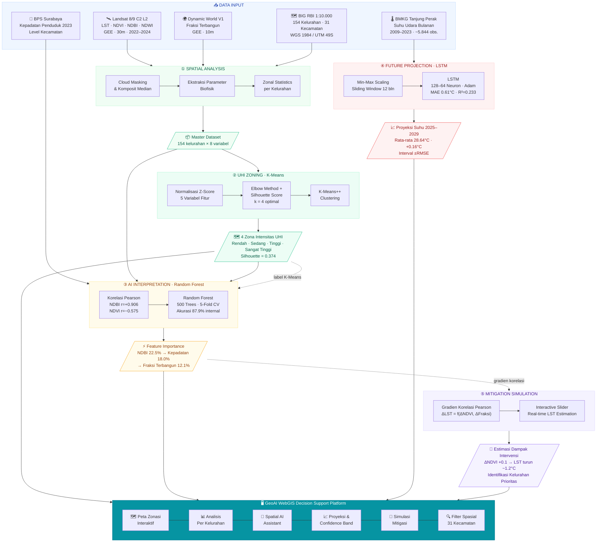

# 🌡️ GeoAI Decision Support System — Urban Heat Island Kota Surabaya

> **Tugas Akhir** · Cevin Abinaya Malewa (NPT 21.24.0005) · Klimatologi STMKG · 2026

[](https://oikochi.github.io/uhi-ai-cevin/)
[](LICENSE)
[]()

---

## 🖥️ Live Dashboard

**[→ Buka GeoAI DSS Platform](https://oikochi.github.io/uhi-ai-cevin/)**

Visualisasi interaktif 154 kelurahan Surabaya: peta zona UHI, analisis per kelurahan, proyeksi LSTM, simulasi mitigasi, dan Spatial AI Assistant.

---

## 🏗️ Framework Sistem



---

## 📊 Hasil Penelitian

| Metode | Metrik | Hasil |
|--------|--------|-------|
| **K-Means** | Silhouette Score | 0,374 (marginal → gradien termal) |
| **K-Means** | Zona terbentuk | 4 zona (Rendah · Sedang · Tinggi · Sangat Tinggi) |
| **Random Forest** | Akurasi (internal) | 87,9% · F1 = 0,879 |
| **RF Feature #1** | NDBI | Importance 0,225 · Korelasi r = +0,906 |
| **RF Feature #2** | Kepadatan | Importance 0,180 |
| **RF Feature #3** | Fraksi Terbangun | Importance 0,121 · Korelasi r = +0,848 |
| **LSTM** | MAE | 0,61 °C |
| **LSTM** | RMSE | 0,80 °C |
| **LSTM** | R² | 0,233 (proyeksi tren) |
| **LSTM** | Proyeksi 2025–2029 | +0,16 °C kenaikan suhu udara |

### Distribusi Zona UHI
```
🔴 Sangat Tinggi (Inti UHI)  ████████████░░░░░░░░░░░░░  45 kelurahan · LST 42,54°C · kepadatan 23.236/km²
🟠 Tinggi                    ████████████████████████░  71 kelurahan · LST 42,25°C · terbangun 96%
🟢 Sedang                    ██████████░░░░░░░░░░░░░░░  34 kelurahan · LST 40,20°C · transisi
🔵 Rendah                    ████░░░░░░░░░░░░░░░░░░░░░  12 kelurahan · LST 36,99°C · vegetasi baik
```

---

## 🗂️ Struktur Repository

```
uhi-ai-cevin/
├── index.html                    # GeoAI DSS Platform (web utama)
├── data/
│   └── surabaya_uhi.geojson     # 154 kelurahan + data analisis
├── hasil_kmeans_zonasi.csv       # Output K-Means per kelurahan
├── hasil_random_forest.csv       # Output Random Forest
├── hasil_prediksi_lstm.csv       # Proyeksi LSTM 2025–2029
├── data_suhu_bulanan.csv         # Historis BMKG 2009–2023
├── kmeans.py                     # Script K-Means clustering
├── randomforest.py               # Script Random Forest
├── lstm.py                       # Script LSTM time series
├── peta_uhi_surabaya.py          # Script kartografi (4 peta)
├── uji_statistik_zona.py         # ANOVA + post-hoc analysis
└── README.md
```

---

## ⚙️ Cara Menjalankan

```bash
# 1. Install dependencies
pip install geopandas matplotlib mapclassify pandas scikit-learn tensorflow scipy

# 2. Analisis K-Means
python kmeans.py

# 3. Random Forest
python randomforest.py

# 4. LSTM Proyeksi
python lstm.py

# 5. Peta (butuh Surabaya_Kelurahan.geojson)
python peta_uhi_surabaya.py

# 6. Uji statistik ANOVA
python uji_statistik_zona.py

# 7. Web (lokal)
python -m http.server 8000
# buka http://localhost:8000
```

---

## 📚 Data & Sumber

| Data | Sumber | Resolusi / Periode |
|------|--------|--------------------|
| LST, NDVI, NDBI, NDWI | Landsat 8/9 C2 L2 (Google Earth Engine) | 30 m · 2022–2024 |
| Fraksi Terbangun | Dynamic World V1 (Google Earth Engine) | 10 m · 2022–2024 |
| Suhu Udara Bulanan | BMKG Sta. Maritim Tanjung Perak | Harian · 2009–2023 |
| Batas Administrasi | **BIG — RBI 1:10.000** | Vektor · WGS 1984 |
| Kepadatan Penduduk | BPS Kota Surabaya | Level kecamatan · 2023 |

> ⚠️ **Catatan transparansi:** Akurasi Random Forest (87,9%) merupakan konsistensi internal terhadap label K-Means — bukan validasi independen. R² LSTM (0,233) rendah — proyeksi diposisikan sebagai arah tren, bukan prediksi presisi. Kepadatan penduduk tersedia level kecamatan, diterapkan pada analisis kelurahan.

---

## 📖 Sitasi

```bibtex
@thesis{malewa2026uhi,
  author  = {Malewa, Cevin Abinaya},
  title   = {Zonasi, Faktor Dominan, dan Proyeksi Tren Suhu Urban Heat Island Kota Surabaya},
  school  = {Sekolah Tinggi Meteorologi Klimatologi dan Geofisika (STMKG)},
  year    = {2026},
  url     = {https://oikochi.github.io/uhi-ai-cevin/}
}
```

---

<div align="center">
  <sub>© 2026 Cevin Abinaya Malewa · Klimatologi STMKG · Data BIG RBI 1:10.000</sub>
</div>
